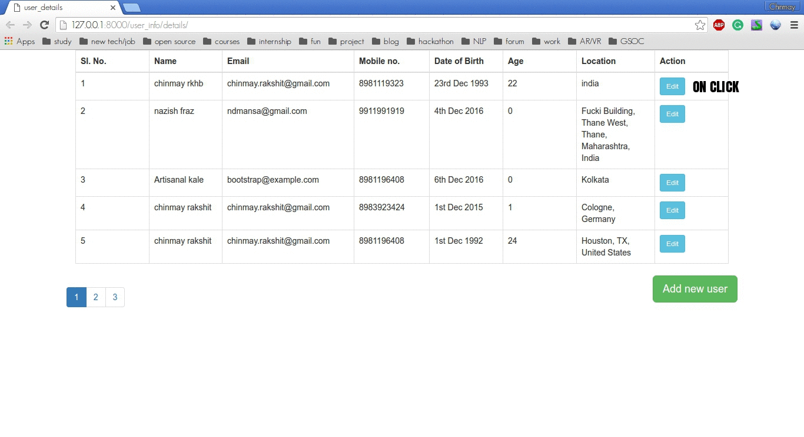

to start with the installation 


* virtualenv -p /usr/bin/python3 py3env  
* source py3env/bin/activate  
* pip install django==1.7

create a project

* django-admin startproject basic_project

now change the database to mysql

```
DATABASES = {
'default': {
    'ENGINE': 'django.db.backends.mysql',
    'NAME': 'DB_NAME',
    'HOST': '127.0.0.1',
    'PORT': '3306',
    'USER': 'root',
    'PASSWORD': '',
}}
```

now install the dependencies.

* sudo apt-get install libmysqlclient-dev
* pip install mysqlclient


Now synchronize the db with django

* cd project_name
* project_name$ python manage.py syncdb

level-1 done!!

________________________________________________________________________________________________

#How to add your app to the main project.. 


```python
from django.apps import AppConfig

class User_infoConfig(AppConfig):
	name = 'name of the app'
```

put this in apps.py in the app package.

add a line   
	'user_info.apps.User_infoConfig'

in the "INSTALLED_APPS" section.

So this way you can add your apps.

_________________________________________________________________________________________________ 


#How to add the database file.

	python manage.py makemigrations user_info
	Migrations for 'user_info':
	  0001_initial.py:
	    - Create model info


to see the create table value.

	 python manage.py sqlmigrate user_info 0001


to actually add start the change

	python manage.py migrate


_________________________________________________________________________________________________

#using the database api in django

	(py3env) deathnote@deathnote:~/Desktop/mycode/Django_projects/basic_project$ python manage.py shell
	Python 3.4.3 (default, Sep 14 2016, 12:36:27) 
	[GCC 4.8.4] on linux
	Type "help", "copyright", "credits" or "license" for more information.
	(InteractiveConsole)
	>>> from user_info.models import info
	>>> info.objects.all()
	[]
	>>> a = info(name = 'chinmay', email = 'chinmay.rakshit@gmail.com', mobile = '8981196408', age ='22', Date_of_birth = '23-12-1993', location = 'kolkata, india')
	>>> a.save()
	>>> a.name
	'chinmay'
	>>> a.id
	1
	>>> b = info()
	>>> b.name = 'naz'
	>>> b.email = 'paltujanwar@gmail.com'
	>>> b.mobile = '9911991919'
	>>> b.age = '22'
	>>> b.date_of_birth = '23-4-1993'
	>>> loaction = 'kolkata, india'
	>>> b.loaction = 'kolkata, india'
	>>> b.save()
	>>> b.name
	'naz'
	>>> a.name = 'chinmay rakshit'
	>>> a.save()
	>>> a.name
	'chinmay rakshit'
	>>> 

change and def __str__(self): in your class inside model and volla it changes!

	>>> from user_info.models import info
	>>> info.objects.all()
	[<info: chinmay rakshit>, <info: naz>]
	>>> info.objects.filter(id =1)
	[<info: chinmay rakshit>]
	>>> info.objects.filter(id =2)
	[<info: naz>]
	>>> info.objects.filter(name__startswith='chin')
	[<info: chinmay rakshit>]

____________________________________________________________________________________________

Suppose you want to extract the regular expression from the url: simply add paranthesis and it will be extracted, make sure you call the same amount otherside :)

  
